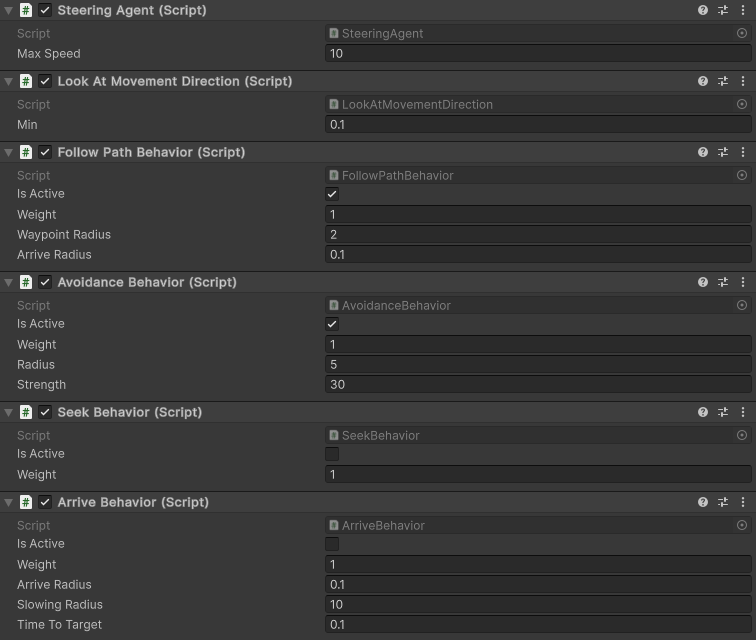

# Crowd Simulation
A modular, component-based crowd simulation demo using `Steering Behavior` system for Unity, implementing `Seek`, `Arrive`, `PathFollow`, and `AvoidanceBehavior` with optimized crowd avoidance using the Unity Job System and Burst Compiler. Designed for efficient NPC movement in 3D games, with support for path-following and collision avoidance.


[The frame rate of this gif preview was lowered for smaller file size.]

## Features
- **Modular Design**: Behaviors (`Seek`, `Arrive`, `PathFollow`, `AvoidanceBehavior`) implement the `ISteeringBehavior` interface, allowing easy addition of new behaviors.
- **Seek**: Moves an agent directly toward a target at maximum speed.
- **Arrive**: Approaches a target with smooth deceleration, stopping within a specified radius.
- **PathFollow**: Guides an agent along a sequence of waypoints, preventing reversal to earlier points.
- **AvoidanceBehavior**: Efficiently avoids other agents using a Burst-compiled job, optimized with persistent `NativeArray`s and distance-based filtering.
- **Performance**: Uses Unity’s Job System and Burst Compiler for fast crowd avoidance, with minimal allocations and pre-filtering of agents.
- **Configurable**: Adjustable parameters for speed, force, radius, and weights via Unity Inspector.
- **Debug**: When you select an agent, you can see path of that agent drawn in the scene view.

## Requirements
- **Unity Version**: 6000.0.41f1


## Run
- Clone the repository:
   ```bash
   git clone https://github.com/ALI-P48/CrowdSimulation.git
   ```
- Open the project in Unity.
- Open `SampleScene` in editor.
- Make sure 900x1200 screen size is selected and Hit play.


## Configuration
- **Setup Agent**: You can find the `NPC` prefab in `Prefabs` folder and change the inspector values.
- **NPC Count**: You can change the NPC count in the inspector settings of `CrowdManager` game object.

